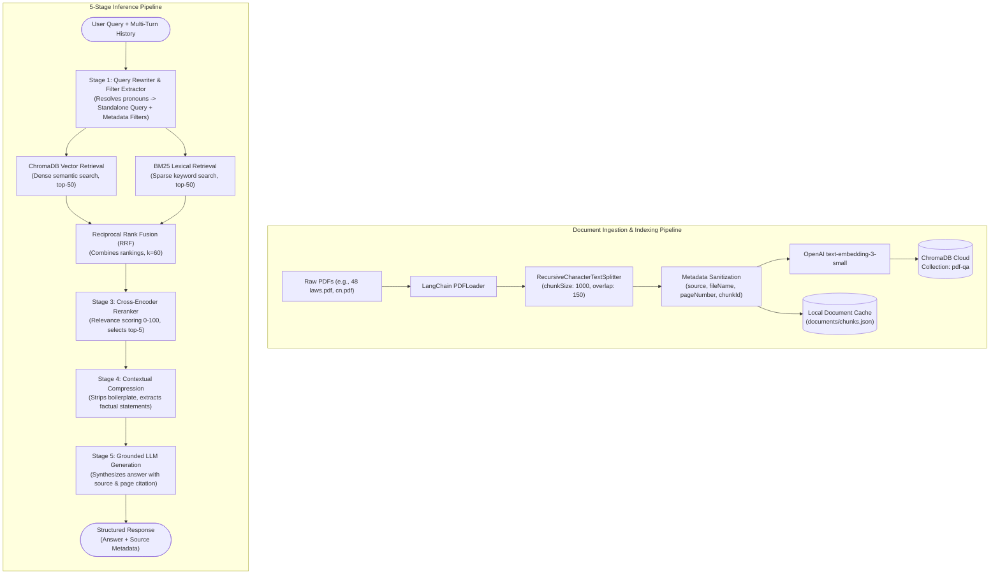

# PDF-QA: Production-Grade Multi-Document Conversational RAG

[](https://nodejs.org/)
[](https://js.langchain.com/)
[](https://www.trychroma.com/)
[](https://openai.com/)
[](#system-architecture)

An enterprise-ready, multi-document **Conversational Retrieval-Augmented Generation (RAG)** system designed to resolve the classic failure modes of naive RAG architectures: pronoun ambiguity in multi-turn dialogues, semantic lures, technical token blindness, and context dilution.

Featuring a **5-stage retrieval & synthesis pipeline**, strict citation attribution, and a **90-query empirical benchmark suite with 6-stage ablation analysis**, this project sets a high standard for document question-answering systems.

---

## Table of Contents

- [Key Capabilities](#key-capabilities)
- [System Architecture](#system-architecture)
- [Pipeline Deep Dive](#pipeline-deep-dive)
  - [Stage 1: Conversational Memory & Query Rewriter](#stage-1-conversational-memory--query-rewriter)
  - [Stage 2: Metadata-Aware Hybrid Retrieval & Reciprocal Rank Fusion](#stage-2-metadata-aware-hybrid-retrieval--reciprocal-rank-fusion)
  - [Stage 3: Cross-Encoder Reranking](#stage-3-cross-encoder-reranking)
  - [Stage 4: Contextual Compression & Noise Reduction](#stage-4-contextual-compression--noise-reduction)
  - [Stage 5: Grounded Synthesis with Citation Tracking](#stage-5-grounded-synthesis-with-citation-tracking)
- [Repository Structure](#repository-structure)
- [Evaluation & Ablation Benchmark Suite](#evaluation--ablation-benchmark-suite)
- [Getting Started](#getting-started)
  - [Prerequisites](#prerequisites)
  - [Environment Setup](#environment-setup)
  - [Installation](#installation)
- [Usage Guide](#usage-guide)
  - [1. Ingesting Documents](#1-ingesting-documents)
  - [2. Conversational Query Execution](#2-conversational-query-execution)
  - [3. Running Benchmarks & Ablation Studies](#3-running-benchmarks--ablation-studies)
- [Configuration & Extensibility](#configuration--extensibility)
- [License](#license)

---

## Key Capabilities

- **Multi-Turn Coreference Resolution**: Resolves pronoun chains ("it", "that device", "these steps", "the second rule") against dialogue history before retrieval occurs.
- **Hybrid Dense + Sparse Search**: Integrates semantic vector search (`text-embedding-3-small` in ChromaDB Cloud) with lexical exact-match BM25 retrieval to capture both concepts and domain-specific tokens (e.g., `Router 1841`, `fastEthernet 0/0`, `telnet`).
- **Reciprocal Rank Fusion (RRF)**: Merges disparate candidate pools without score calibration discrepancies using weighted rank reciprocals.
- **Cross-Encoder Relevance Reranker**: Scrutinizes top candidate chunks using an LLM evaluator to filter out semantic distractors and false positives.
- **Dynamic Contextual Compression**: Strips extraneous paragraphs, chapter boilerplate, and noise—extracting strictly answering statements to combat the "lost-in-the-middle" token degradation.
- **Strict Verifiable Citations**: Every response attributes source documents and specific page numbers.
- **Comprehensive Evaluation Harness**: Built-in 90-query multi-category benchmark measuring `Recall@3`, `MRR`, `Answer Correctness` (LLM-as-a-judge), `Citation Accuracy`, `Avg Latency`, and `Context Footprint`.

---

## System Architecture



---

## Pipeline Deep Dive

### Stage 1: Conversational Memory & Query Rewriter
In conversational interactions, follow-up queries frequently rely on pronouns or elided context (e.g., *"What interface does it use?"* following a question about a router).
- **Coreference Rewriting**: A structured LLM pass analyzes the preceding conversation turns and reforms the input into an unambiguous, self-contained search query.
- **Automated Filter Extraction**: Simultaneously extracts structured metadata filters (such as `pageNumber`, `fileName`, or `year`) directly from natural language phrases (e.g., *"on page 24"* $\rightarrow$ `{ "pageNumber": 24 }`).

### Stage 2: Metadata-Aware Hybrid Retrieval & Reciprocal Rank Fusion
Vector embeddings alone struggle with exact technical tokens, model identifiers, or short acronyms. Conversely, keyword search misses synonyms and conceptual phrasing. This pipeline runs both in parallel:
1. **Dense Vector Search**: Queries ChromaDB Cloud using OpenAI's `text-embedding-3-small` with pre-filtering against document metadata.
2. **Sparse Lexical Search**: Runs an in-memory `BM25Retriever` over pre-filtered candidate document chunks.
3. **Reciprocal Rank Fusion (RRF)**: Merges the ranked lists into a unified ranking using the standard formula:

$$\text{RRF\_Score}(d \in D) = \sum_{m \in M} \frac{w_m}{k + r_m(d)}$$

Where:
- $M = \{\text{Vector}, \text{BM25}\}$
- $w_m = 0.5$ (configurable weight per retrieval modality)
- $k = 60$ (smoothing parameter mitigating bias toward top ranks)
- $r_m(d)$ is the 1-based rank position of chunk $d$ in system $m$

### Stage 3: Cross-Encoder Reranking
High-scoring semantic vectors can be misled by text passages that share topical vocabulary without containing the actual answer (semantic lures). 
- Candidate passages from RRF are fed into an LLM-based Cross-Encoder reranker.
- The model evaluates passage-query alignment on a calibrated 0–100 scale:
  - `90–100`: Direct, comprehensive answer.
  - `60–89`: Highly relevant supporting context.
  - `20–59`: Tangentially related context.
  - `0–19`: Irrelevant or distractor content.
- Candidates are sorted by rerank score, and the top-$K$ ($K=5$) are propagated to Stage 4.

### Stage 4: Contextual Compression & Noise Reduction
Standard chunking often captures 1,000 characters of surrounding text, much of which consists of transitions, filler, or headers. Sending redundant tokens increases latency, cost, and hallucination risk.
- The contextual compression engine analyzes each ranked chunk against the standalone query.
- Only exact factual statements, parameters, code, and instructions answering the question are preserved.
- Unrelated chunks are discarded entirely.
- **Typical performance**: Achieves **40%–70% reduction in context length**, maximizing information density.

### Stage 5: Grounded Synthesis with Citation Tracking
The final prompt injects only the compressed, high-density facts paired with origin metadata (`fileName`, `pageNumber`).
- The generation model answers concisely based strictly on the supplied facts.
- Explicit citations are guaranteed in the output, allowing end-users to audit answers directly against the source PDF page.

---

## Repository Structure

```text
pdf-QA/
├── documents/
│   ├── 48 laws.pdf          # 651-page historical corpus (The 48 Laws of Power)
│   ├── cn.pdf               # 5-page technical lab corpus (Cisco Packet Tracer / Telnet)
│   └── chunks.json          # Pre-processed chunks & metadata cache for rapid benchmark evaluation
├── src/
│   ├── ingestion.js         # Document loader, chunker, embedding generator, & ChromaDB cloud uploader
│   ├── query.js             # Core 5-stage conversational RAG pipeline & interactive CLI
│   ├── evaluate.js          # Benchmark execution harness, ablation study runner, & metric computation
│   └── dataset.js           # 90-query evaluation benchmark across 8 failure-mode categories
├── .env.example             # Template for required environment variables
├── package.json             # NPM dependencies, scripts, and module definitions
└── README.md                # Production architecture & operational documentation
```

---

## Evaluation & Ablation Benchmark Suite

To prevent regression and quantitatively validate every architectural component, the system includes a **90-query benchmark dataset** (`src/dataset.js`) specifically engineered across 8 edge-case categories:

| Category | Query Count | Target Failure Mode Tested |
| :--- | :---: | :--- |
| **Normal Factual** | 20 | Baseline single-turn retrieval & direct fact extraction |
| **Exact Keyword / Technical** | 10 | Exact identifier blindness in vector search (`Router 1841`, CLI commands) |
| **Ambiguous Queries** | 10 | Under-specified queries requiring query reformulation |
| **Conversational Follow-ups** | 10 | Coreference and pronoun degradation across dialogue history |
| **Multi-Hop Reasoning** | 10 | Information synthesis spanning multiple laws, pages, or network steps |
| **Metadata-Filtered** | 10 | Target retrieval constrained by specific page numbers or documents |
| **Non-Top-1 Semantic Lures** | 10 | High-similarity traps where the true answer is buried in lower ranks |
| **Adversarial / Distractors** | 10 | Robustness against noisy documents with overlapping terminology |

### 6-Stage Ablation Configurations

The test suite evaluates 6 progressive pipeline states to isolate the impact of each layer:

1. **Baseline (Vector Only)**: Naive top-3 similarity search using `text-embedding-3-small`.
2. **+ Hybrid (Vector + BM25)**: Adds BM25 sparse retrieval merged via Reciprocal Rank Fusion.
3. **+ Reranker**: Adds Stage 3 Cross-Encoder relevance scoring.
4. **+ Query Rewrite / Memory**: Activates Stage 1 conversational memory and coreference resolution.
5. **+ Metadata Filters**: Enables automated entity filter extraction and targeted index querying.
6. **Final RAG (+ Compression)**: The complete 5-stage pipeline with contextual noise compression.

### Quantitative Metrics Tracked

- **Recall@3**: Proportion of queries where at least one ground-truth chunk/page is retrieved in top-3 candidates.
- **MRR (Mean Reciprocal Rank)**: Position penalty metric measuring how high the first correct chunk ranks:
  $$\text{MRR} = \frac{1}{|Q|} \sum_{i=1}^{|Q|} \frac{1}{\text{rank}_i}$$
- **Answer Correctness**: Automated LLM-as-a-Judge semantic scoring (0%–100%) against ground truth.
- **Citation Accuracy**: Percentage of generated answers containing valid page-number citations.
- **Avg Latency (ms)**: End-to-end execution time per query.
- **Context Footprint (chars)**: Number of characters passed to the final generation stage.

---

## Getting Started

### Prerequisites

- **Node.js**: v18.0.0 or higher
- **OpenAI API Key**: Access to `text-embedding-3-small`, `gpt-4o-mini`, and chat models.
- **ChromaDB Cloud Account**: An active ChromaDB Cloud instance or self-hosted Chroma instance.

### Environment Setup

Create a `.env` file in the project root:

```bash
cp .env.example .env
```

Populate the required credentials in `.env`:

```env
OPENAI_API_KEY=sk-...
CHROMADB_API_KEY=...
```

### Installation

Install project dependencies:

```bash
npm install
```

---

## Usage Guide

### 1. Ingesting Documents

To parse, chunk, embed, and index a PDF into your ChromaDB Cloud collection:

```bash
# Ingest the default document (documents/48 laws.pdf)
npm run ingest

# Or specify a custom PDF file
node src/ingestion.js "documents/cn.pdf"
```

The script will:
1. Load all pages and log total page count.
2. Chunk text with `chunkSize: 1000` and `chunkOverlap: 150`.
3. Enrich metadata with `source`, `fileName`, `pageNumber`, `totalPages`, and `chunkId`.
4. Generate embeddings and batch-upload documents (100 chunks per batch) into ChromaDB.

### 2. Conversational Query Execution

#### Automated Multi-Turn Demonstration
Execute an automated 3-turn demonstration exhibiting pronoun resolution across consecutive turns:

```bash
npm run query
```

#### Interactive Conversational CLI
Launch an interactive multi-turn shell session where conversational history is maintained:

```bash
npm run query -- --interactive
# or
node src/query.js -i
```

Example interaction:
```text
You: What router model is introduced on page 2?
[STAGE 1: Query Rewriter] -> Standalone Query: "What router model is introduced on page 2?"
[STAGE 2: Hybrid Retrieval] -> Vector: 50 chunks, BM25: 50 chunks -> RRF Fusion
[STAGE 3: Reranker] -> Scored top candidates (Top score: 98/100)
[STAGE 4: Contextual Compression] -> Compressed context by 62%
[FINAL ANSWER] The router model introduced on page 2 is Cisco Router 1841 (cn.pdf, Page 2).

You: What interface does it use?
[STAGE 1: Query Rewriter] -> Rewritten for Search: "What interface does Cisco Router 1841 use?"
...
[FINAL ANSWER] Cisco Router 1841 uses FastEthernet 0/0 and Serial 0/0/0 interfaces (cn.pdf, Page 2).
```

### 3. Running Benchmarks & Ablation Studies

#### Full 90-Query Ablation Study
Runs all 6 pipeline configurations against the entire evaluation dataset:

```bash
npm run eval
```

#### Filtered Category Evaluation
Run the ablation study against a specific failure mode:

```bash
# Evaluate only conversational follow-ups
node src/evaluate.js --category "conversational"

# Evaluate technical exact keywords
node src/evaluate.js --category "keyword"
```

#### Fast Smoke-Test / Limited Run
Limit the evaluation to a subset of balanced queries across categories:

```bash
# Run a quick 8-query balanced smoke test (1 query per category)
node src/evaluate.js --limit 8
```

---

## Configuration & Extensibility

All core hyperparameters are modular and can be adapted for specific workloads:

| Parameter | Location | Default | Description |
| :--- | :--- | :--- | :--- |
| `chunkSize` | [src/ingestion.js](file:///C:/Users/abhin/OneDrive/Desktop/ai-cohort/projects/pdf-QA/src/ingestion.js#L22) | `1000` | Max characters per document chunk |
| `chunkOverlap` | [src/ingestion.js](file:///C:/Users/abhin/OneDrive/Desktop/ai-cohort/projects/pdf-QA/src/ingestion.js#L23) | `150` | Overlap character buffer between adjacent chunks |
| `rrf k` | [src/query.js](file:///C:/Users/abhin/OneDrive/Desktop/ai-cohort/projects/pdf-QA/src/query.js#L121) | `60` | Rank smoothing constant for Reciprocal Rank Fusion |
| `weights` | [src/query.js](file:///C:/Users/abhin/OneDrive/Desktop/ai-cohort/projects/pdf-QA/src/query.js#L121) | `[0.5, 0.5]` | Relative weighting between Vector and BM25 search |
| `topK` (Rerank) | [src/query.js](file:///C:/Users/abhin/OneDrive/Desktop/ai-cohort/projects/pdf-QA/src/query.js#L152) | `5` | Number of candidate chunks preserved after cross-encoder |
| `embeddingModel`| [src/query.js](file:///C:/Users/abhin/OneDrive/Desktop/ai-cohort/projects/pdf-QA/src/query.js#L307) | `text-embedding-3-small` | OpenAI embedding model |
| `evalModel` | [src/query.js](file:///C:/Users/abhin/OneDrive/Desktop/ai-cohort/projects/pdf-QA/src/query.js#L68) | `gpt-4o-mini` | Low-latency LLM for rewriter, reranker, and compressor |

---

## License

This project is licensed under the ISC License. See `package.json` for details.
